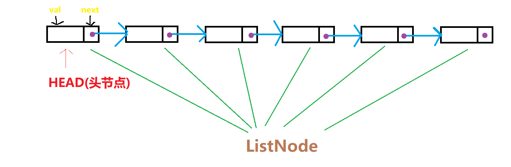

# 《从尾到头打印链表》
## 题目描述
>输入一个链表，按链表值从尾到头的顺序返回一个ArrayList。  
时间限制：1秒 空间限制：32768K

## 思路

```java
//题目所提供的链表类
     public class ListNode {
         int val;
        ListNode next = null;
         ListNode(int val) {
             this.val = val;
         }
     }
```
__按题目提供的链表来看，这是个单向链表，每个节点都含有本节点的值val和指向下一个节点的指针next。（如下图所示）__  


__题意非常明了，就是让我们从尾到头打印这个链表，也就是返回一个从尾到头储存此链表的值的ArrayList。__  

__第一种解法：利用递归遍历这个链表，当next指针指向null时，即已经遍历到最后一个节点，此时将此节点的值（val）添加到ArrayList中，最后返回这个ArrayList__

__第二种解法：第二种解法和第一个解法相似，利用栈遍历这个链表，即每遍历一个链表节点就把它进栈，当遍历完成时，把整个栈都pop出来。__  

__当链表非常长的时候，就会导致函数调用的层级很深，从而有可能导致函数调用栈溢出（java.lang.StackOverflowError），所以用栈基于循环实现的代码的鲁棒性要好一些~__


***

## 代码
### 递归解法（第一种解法）
```java
/**
 * @author Jackid
 * JDK-version:1.8
 * Problem:牛客网-剑指offer《从尾到头打印链表》
 * Result:已通过了所有的测试用例
 */

/*题目描述：
输入一个链表，按链表值从尾到头的顺序返回一个ArrayList。*/

//递归解法
import java.util.ArrayList;

public class Solution {
	ArrayList<Integer> record = new ArrayList<Integer>();//创建ArrayList对象record，用来记录链表中每个节点的数值

	public ArrayList<Integer> printListFromTailToHead(ListNode listNode) {
		if (listNode != null) {//判断当前结点是否为空
			printListFromTailToHead(listNode.next);//如果当前结点不为空，则递归调用printListFromTailToHead方法，其中方法参数为当前结点所指向的下一个结点
			record.add(listNode.val);//把当前结点的值添加进数组中，因为递归的关系，数组会从尾到头添加链表结点的值
		}
		return record;//给调用它的方法返回record数组
	}
}
```  
### 栈解法（第二种解法）
```java
/**
 * @author Jackid
 * JDK-version:1.8
 * Problem:牛客网-剑指offer《从尾到头打印链表》
 * Result:已通过了所有的测试用例
 */

/*题目描述：
输入一个链表，按链表值从尾到头的顺序返回一个ArrayList。*/

//栈解法
import java.util.ArrayList;
import java.util.Stack;

public class Solution_addition1 {
	ArrayList<Integer> record = new ArrayList<Integer>();// 创建ArrayList对象record，用来记录链表中每个节点的数值

	public ArrayList<Integer> printListFromTailToHead(ListNode listNode) {
		Stack<Integer>stack=new Stack<>();//定义一个栈用来储存链表节点的值
		
		while (listNode != null) {//遍历链表，当链表不为空时，把节点进栈
			stack.push(listNode.val);
			listNode=listNode.next;
		}
		
		while(!stack.empty())//把栈中的元素全部出栈，并依次添加到ArrayList中
		{
			record.add(stack.pop());
		}
		
		return record;//返回ArrayList
	}
}

```

***
<div align="center">
所有代码均上传至github，欢迎star！<br/>
文章同步于微信公众号，欢迎关注！  

github地址:  
https://github.com/JackidSAMA/NOWCODER.com-Offer-JAVA_Solution  
  
微信公众号:  
JackidSAMA  

</div>
