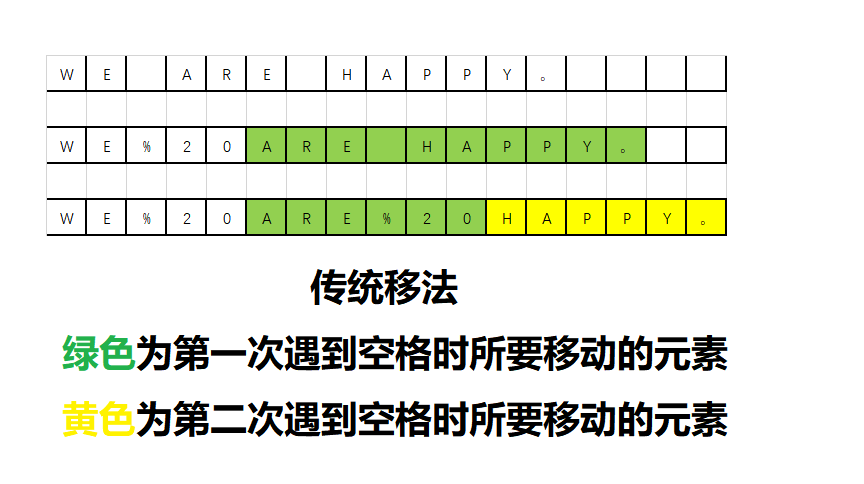
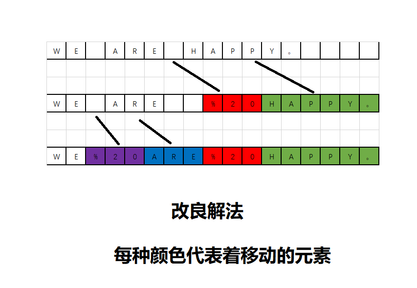

# 《替换空格》
## 题目描述
>请实现一个函数，将一个字符串中的每个空格替换成“%20”。例如，当字符串为We Are Happy.则经过替换之后的字符串为We%20Are%20Happy。  
时间限制：1秒 空间限制：32768K  

## 思路
__按照传统的方法，遍历字符串，每遇到一个空格就把它替换成"%20"，按照这样的做法，假设字符串的长度是n，对于每个空格字符，需要移动后面O(n)个字符，因此对于含有O(n)个空格字符的字符串而言，总的时间效率为O(n*n),如下图所示.__  


__如果我们先将Stringbuffer扩容，定义一个指针pre指向扩容前最后一个字符的位置，再定义一个指针current指向扩容后的Stringbuffer的终点，当遇到非空格时，指针current复制指针pre指向的内容，两者同时向前移动一步；当遇到空格时，指针current指向的内容分别换成'0'、'2'、'%'，每次向前移动一步，总共三步，而指针pre在最后向前移一步。__
__当指针pre和指针current相遇时，则为替换完成的时候。总的时间效率为O(n)。__


## 代码
### 这种解法时间复杂度为O(n)
```java
public class Solution {
	/**
	 * @author Jackid
	 * JDK-version:1.8
	 * Problem:牛客网-剑指offer《替换空格》
	 * Result:已通过了所有的测试用例
	 */
	/*
		请实现一个函数，将一个字符串中的每个空格替换成“%20”。例如，当字符串为We Are Happy.则经过替换之后的字符串为We%20Are%20Happy。  
	 */
	public String replaceSpace(StringBuffer str) {
		int old_length = str.length();// 字符串长度
		int space_amount = 0;// 原字符串中空格的数量

		for (char i : str.toString().toCharArray()) {// 遍历字符串，以获得空格的数量
			if (i == ' ') {
				space_amount += 2;
			}
		}

		str.setLength(str.length() + space_amount);// 把str扩容为将空格替换成%20后的容量
		int pre = old_length - 1;// 原字符串的最后一个字符的下标
		int current = str.length() - 1;// 扩容后字符串的最后一个字符的下标

		// 开始扫描！！！
		while (pre != current)// 当pre指针和current指针走不到一起时
		{
			if (str.charAt(pre) != ' ') {// 当扫描到非空格的字符时
				// 字符串current位置复制pre位置的字符，然后都向前走一步(后置减)
				str.setCharAt(current--, str.charAt(pre--));
			} else {// 当扫描到空格时
				// current指针连续替换成目标字符串"%20",每一次完成替换都向前走一步(后置减)
				str.setCharAt(current--, '0');
				str.setCharAt(current--, '2');
				str.setCharAt(current--, '%');
				// 因为替换完成，所以pre往前一步
				pre--;
			}
		}

		// 最后返回字符串
		return str.toString();
	}

}
```  

***
<div align="center">
所有代码均上传至github，欢迎star！<br/>
文章同步于微信公众号，欢迎关注！  

github地址:  
https://github.com/JackidSAMA/NOWCODER.com-Offer-JAVA_Solution  
  
微信公众号:  
JackidSAMA  

</div>
