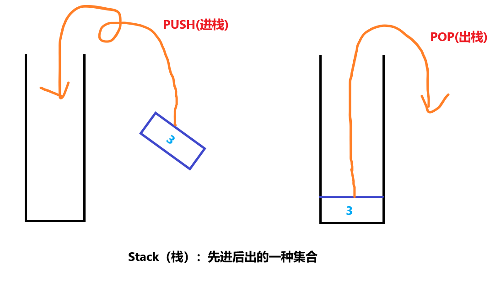
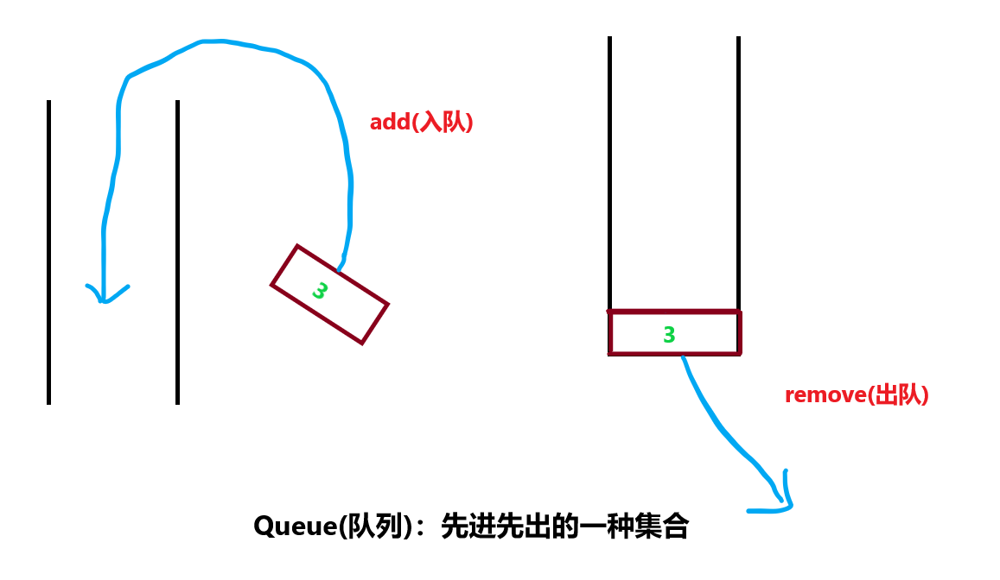
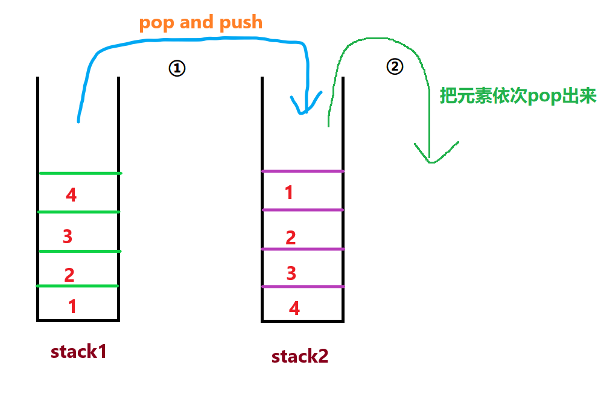

# 《用两个栈实现队列》
## 题目描述
>用两个栈来实现一个队列，完成队列的Push和Pop操作。 队列中的元素为int类型。  
时间限制：1秒 空间限制：32768K

## 思路


__先来看看栈和队列到底是什么。__  



众所周知，栈是**先进后出**的结构，队列则是**先进先出**的结构，两者**相反**。  

看到这里，相信屏幕前的你应该有想法了，如果把整个栈里的元素“旋转”一次，依次出栈，那不就是我们想要的结果吗？

话虽这样说，可是java.util.Stack这个栈类并没有关于旋转的方法。这时候，我们注意到题目中出现了“两个栈”这个词，哎~我们把第一个栈的元素依次**出栈**并依次**push**进第二个栈中，第二个栈再依次**抛出**它的元素，不就是实现了一个队列吗？如下图。  


到了这里，你已经理解了整个解题的思想啦。不过，需要注意的是，题目的测试数据并不只有一组，也就是说，它会随机地进行几次出队（pop），入队（push）的操作，而我们上面进行的只是针对一次入队和出队的操作。

那么，完整的流程应该是这样：  
当系统需要进行**出队**（pop）操作时，首先检查第二个栈stack2是否为空，**是**的话就正常出栈（pop），**不是**的话就检查第一个栈stack1是否为空，当第一个栈stack1**是**为空的话就直接抛出异常（因为整个队列都没有元素）；**不是**的话就把第一个栈的元素全部pop出来并且push进第二个栈中，然后第二个栈再执行pop操作。  
当系统需要进行**入队**（push）操作时，将元素push进第一个栈stack1中。


***
**Talk is cheap......**
## 代码
```java
/**
 * @author Jackid
 * JDK-version:1.8
 * Problem:牛客网-剑指offer《用两个栈实现队列》
 * Result:已通过了所有的测试用例
 */

/*题目描述：
用两个栈来实现一个队列，完成队列的Push和Pop操作。 队列中的元素为int类型。*/

import java.util.Stack;

public class Solution {
    Stack<Integer> stack1 = new Stack<Integer>();
    Stack<Integer> stack2 = new Stack<Integer>();
    
    public void push(int node) {
        stack1.push(node);
    }
    
    public int pop() {
    if (stack1.empty()&&stack2.empty()) {
		throw new RuntimeException();
	}
    
    if (stack2.empty()) {
		while(!stack1.empty())
		{
			stack2.push(stack1.pop());
		}
	}
    return stack2.pop();
    }
}
```  

***
<div align="center">
所有代码均上传至github，欢迎star！<br/>
文章同步于微信公众号，欢迎关注！  

github地址:  
https://github.com/JackidSAMA/NOWCODER.com-Offer-JAVA_Solution  
  
微信公众号:  
JackidSAMA  

</div>
