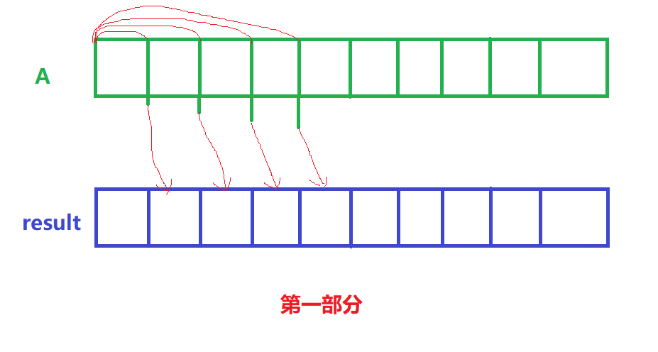
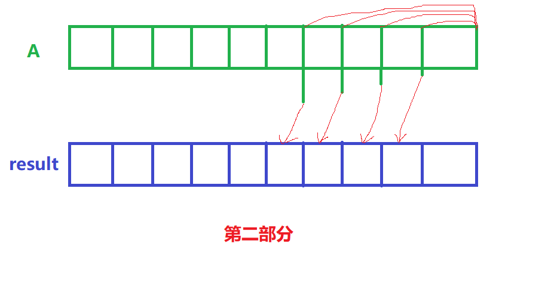

# 《构建乘积数组》
## 题目描述
>给定一个数组A[0,1,...,n-1],请构建一个数组B[0,1,...,n-1],其中B中的元素B[i]=A[0]\*A[1]\*...\*A[i-1]\*A[i+1]\*...\*A[n-1]。不能使用除法。  
时间限制：1秒 空间限制：32768K

## 心得
这题主要是总结每一个元素的组成和其它元素的组成有何差异，再找出规律，而不是通过暴力算出每一个元素的值。  

***

将乘积分为两部分，一部分为A[0]\*A[1]\*...\*A[i-1]，另一部分为A[i+1]\*...\*A[n-1]，先算出第一部分的值并赋值给最终需要返回的数组，然后算出第二部分的值，最后将第一部分和第二部分相乘并赋值给最终需要返回的数组，得出结果。

***
**Talk is cheap......**
## 代码
```java
/**
 * @author Jackid
 * JDK-version:1.8
 * Problem:牛客网-剑指offer《构建乘积数组》
 * Result:已通过了所有的测试用例
 */
/*题目描述:
给定一个数组A[0,1,...,n-1],请构建一个数组B[0,1,...,n-1],
其中B中的元素B[i]=A[0]*A[1]*...*A[i-1]*A[i+1]*...*A[n-1]。
不能使用除法。
 */
public class Solution {
	public int[] multiply(int[] A) {
		int[] result = new int[A.length];// 创建一个和A数组容量一样的数组
		if (result.length < 2) {// 如果A的元素数量少于2，直接返回我们创建的数组，因为不合题意
			return result;
		}

		// 将乘积分为两部分，一部分为A[0]*A[1]*...*A[i-1]，另一部分为A[i+1]*...*A[n-1]，最后将两个部分相乘即可得出结果
		// 先将result[]都变成第一部分的结果
		result[0] = 1;
		for (int i = 1; i < result.length; i++) {
			result[i] = result[i - 1] * A[i - 1];
		}

		// 此时，result[]为第一部分，temporary为第二部分，现在将第一部分与第二部分相乘。
		int temporary = 1;
		for (int i = result.length - 2; i >= 0; i--) {
			temporary *= A[i + 1];
			result[i] *= temporary;
		}
		return result;// 返回结果
	}
}
```  

***
<div align="center">
所有代码均上传至github，欢迎star！<br/>
文章同步于微信公众号，欢迎关注！  

github地址:  
https://github.com/JackidSAMA/NOWCODER.com-Offer-JAVA_Solution  
  
微信公众号:  
JackidSAMA  

</div>
