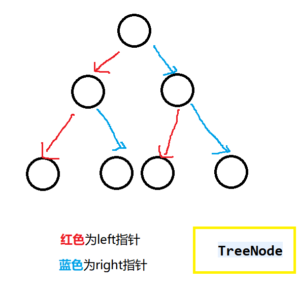
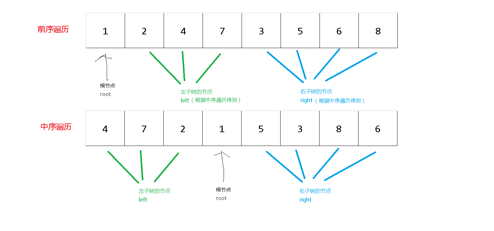
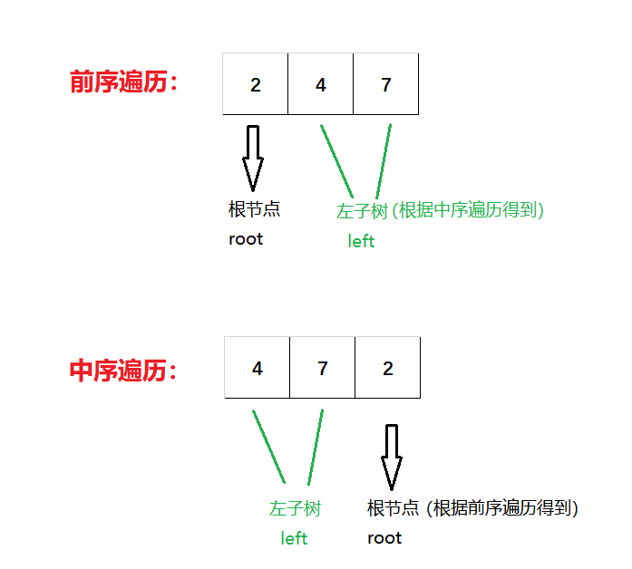
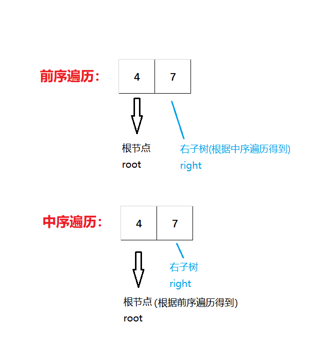
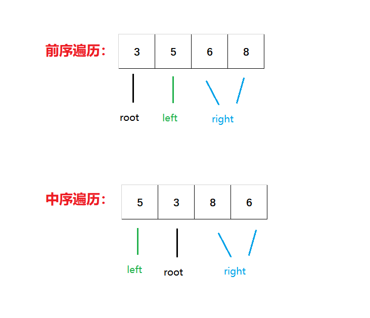

# 《重建二叉树》
## 题目描述
>输入某二叉树的前序遍历和中序遍历的结果，请重建出该二叉树。假设输入的前序遍历和中序遍历的结果中都不含重复的数字。例如输入前序遍历序列{1,2,4,7,3,5,6,8}和中序遍历序列{4,7,2,1,5,3,8,6}，则重建二叉树并返回。  
时间限制：1秒 空间限制：32768K

## 思路

```java
//题目所提供的二叉树类
public class TreeNode {
	int val;
	TreeNode left;
	TreeNode right;

	TreeNode(int x) {
		val = x;
	}
}
```
__按题目提供了一个二叉树类，每个节点都含有本节点的值val、指向它的左节点的指针left、指向它的右节点的指针right。（如下图所示）__  


__题目给定了对该树的前序遍历和中序遍历，题意让我们通过这两个遍历得出整棵树的组成。__  

__首先，先要理解前序遍历和中序遍历的特点。__

前序遍历：对一棵树进行遍历，先遍历它的**根节点**，再遍历它的**左边的节点**，最后遍历它的**右边的节点**。

中序遍历：对一棵树进行遍历，先遍历它的**左边的节点**，再遍历它的**根节点**，最后遍历它的**右边的节点**。

后序遍历：对一棵树进行遍历，先遍历它的**左边的节点**，再遍历它的**右边的节点**，最后遍历它的**根节点**。

这个时候很容易得到**前序遍历**和**中序遍历**之间的**特点**：对于一棵树来说，**前序遍历**的**第一个元素**肯定是这棵树的**根节点（root）**；在**中序遍历**中，这个根节点**前面**的所有位置都是它的**左子树**，这个根节点**后面**的所有位置都是它的**右子树**

重点来了！
既然知道根节点（root）的位置，也知道左子树和右子树的范围，就可以把根节点（root）的**left**指针指向**左子树**，**right**指针指向**右子树**。
然后把左子树和右子树看成一棵**新树**处理，处理过程和上面的流程一样。
子树为**空**时，就返回**null**，**不为空**就返回该子树的**根节点（root）**。

**以题目中的样例进行说明：**  
第一次处理：
  
第二次处理（进入到第一次处理的左子树）：
  
第三次处理（进入到第二次处理的左子树）：
  
以上是总树的左子树的left指针的处理过程，以此类推，right指针也是同样的道理~  
当总树的左子树的left和right指针安排妥当后，就要去安排总树的右子树啦。  
以下是总树的右子树的第一次处理过程



***
**Talk is cheap......**
## 代码
### 递归解法
```java
/**
 * @author Jackid JDK-version:1.8 Problem:牛客网-剑指offer《重建二叉树》 Result:已通过了所有的测试用例
 */

/*
 * 题目描述： 输入某二叉树的前序遍历和中序遍历的结果，请重建出该二叉树。假设输入的前序遍历和中序遍历的结果中都不含重复的数字。
 * 例如输入前序遍历序列{1,2,4,7,3,5,6,8}和中序遍历序列{4,7,2,1,5,3,8,6}，则重建二叉树并返回。
 */

public class Solution {
	public TreeNode reConstructBinaryTree(int[] pre, int[] in) {
		return reConstructBinaryTree(pre, 0, pre.length - 1, in, 0, in.length - 1);// 初始化参数并进入递归
	}

	public TreeNode reConstructBinaryTree(int[] pre, int startpre, int endpre, int[] in, int startin, int endin) {// 每一次调用都是一棵新树
		if (startpre > endpre || startin > endin) {// 子树没有元素时，返回null
			return null;
		}
		TreeNode root = new TreeNode(pre[startpre]);// 将该范围数组的第一个元素设置为根节点
		for (int i = startin; i <= endin; i++) {
			if (in[i] == pre[startpre]) {// 找到根节点时
				// 根节点前面的所有位置都是它的左子树，left指针指向左子树
				root.left = reConstructBinaryTree(pre, startpre + 1, startpre + i - startin, in, startin, i - 1);
				// 根节点后面的所有位置都是它的右子树，right指针指向右子树
				root.right = reConstructBinaryTree(pre, startpre - startin + i + 1, endpre, in, i + 1, endin);
				break;
			}
		}
		return root;// 返回根节点
	}
}
```  

***
<div align="center">
所有代码均上传至github，欢迎star！<br/>
文章同步于微信公众号，欢迎关注！  

github地址:  
https://github.com/JackidSAMA/NOWCODER.com-Offer-JAVA_Solution  
  
微信公众号:  
JackidSAMA  

</div>
